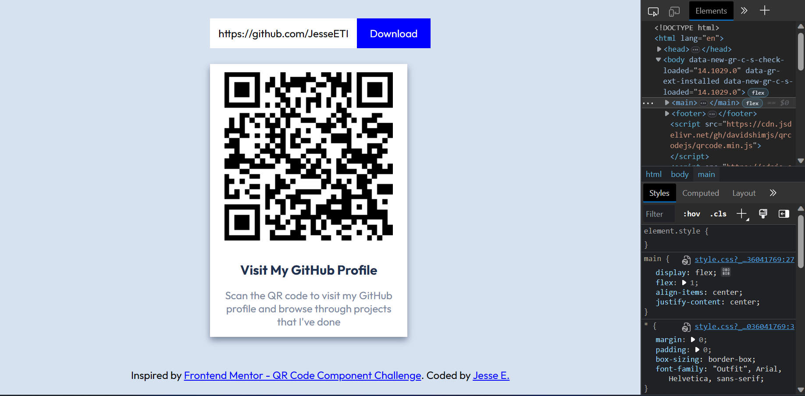

# QR Card Generator

A website built with HTML, CSS and JavaScript that allows you to create, print and download your own QR card for free.

## Table of contents

- [Features](#features)
- [Screenshots](#screenshots)
- [Built with](#built-with)
- [Motivation](#motivation)
- [Useful resources](#useful-resources)
- [Inspiration](#inspiration)
- [One last thing...](#one-last-thing)

### Features

- Mobile-First Responsive Design
- Instant QR generation based on user input
- Edit title and subtext of your QR card
- Download QR Code into .zip file containing
  - PNG
  - PDF
  - EPS
- Quick print QR code from page (2.0 inch width for contact card)
- Loading and Error Handling states
- WAI-ARIA accessible standards

### Screenshots

### Built with

- HTML5
- CSS
- JavaScript

### Motivation

> In 2022, approximately 89 million smartphone users in the United States scanned a QR code on their mobile devices, up by 26 percent compared to 2020. Usage of mobile QR code scanners is projected to experience constant growth, reaching over 100 million users in the U.S. by 2025. - [Publication by L. Ceci](https://www.statista.com/statistics/1297768/us-smartphone-users-qr-scanner/)

### Useful resources

- [W3 Schools](https://www.w3schools.com/css/) - Basically everything you'd need to know to cover CSS concepts from the ground up.
- [QRCode.js](https://davidshimjs.github.io/qrcodejs/) - JavaScript Library used to generate QR codes on the fly
- [html2canvas](https://html2canvas.hertzen.com/) - Take a screenshot of your website / in this case the QR card, and converts it into a canvas image which can be converted to PNG.
- [JSZip](https://stuk.github.io/jszip/) - Create a .zip file in JavaScript
- [jsPDF](https://parall.ax/products/jspdf/) - Create a .pdf file in JavaScript
- [FileSaver.js](https://github.com/eligrey/FileSaver.js/) - Download files locally from the browser

### Inspiration

- [Frontend Mentor - QR Code Component Challenge](https://www.frontendmentor.io/challenges/qr-code-component-iux_sIO_H) - This project originally started off as a challenge to build a responsive QR card based on the images + style guide provided. After completing the challenge, I adjusted the CSS to my tastes and decided to take it a step further and make the card functional with JavaScript so that it will be useful for those wanting to get their own nice looking QR card in various formats to share, edit and print.

### One last thing...

If you made it this far into reading my readme, thank you, and **keep on being a rockstar!** 🤘
